# PD2 MCP Orchestrated RE Platform - Architecture Analysis & Containerization Strategy

## Current Containerization Review

Let me analyze the current design and provide optimal containerization recommendations:

## 🏗️ **Current Container Architecture (docker-compose.yml Analysis)**

### ✅ **Well-Containerized Services**
1. **dgraph-zero & dgraph-alpha**: ✅ Properly containerized graph database
2. **redis**: ✅ Properly containerized session/cache storage  
3. **nginx**: ✅ Properly containerized reverse proxy

### ⚠️ **Containers Needing Optimization**
1. **d2-analysis**: Currently monolithic - contains game + analysis + MCP server
2. **mcp-coordinator**: Handles too many responsibilities
3. **analysis-engine**: Undefined scope in current docker-compose
4. **web-dashboard**: Basic implementation
5. **network-monitor**: Shares network namespace (good) but needs refinement

## 🎯 **Recommended Container Architecture**

### **Separation of Concerns Principle**

```yaml
# Optimized Container Strategy
services:
  # === GAME EXECUTION LAYER ===
  d2-game-runner:
    # ONLY runs Diablo 2 in Wine
    # Minimal, focused container
    
  # === ANALYSIS LAYER ===  
  memory-analyzer:
    # Dedicated memory analysis
    # Connects to game runner via shared volumes/network
    
  network-analyzer:
    # Dedicated network packet analysis
    # Uses network_mode: "container:d2-game-runner"
    
  static-analyzer:
    # Ghidra + other static analysis tools
    # Processes binaries from shared storage
    
  # === ORCHESTRATION LAYER ===
  mcp-coordinator:
    # Pure coordination logic
    # No analysis - just orchestration
    
  # === MCP SERVERS ===
  mcp-d2-server:
  mcp-ghidra-server: 
  mcp-network-server:
  mcp-memory-server:
    # Each MCP server in its own container
    
  # === DATA LAYER ===
  dgraph-alpha:     # ✅ Already optimal
  dgraph-zero:      # ✅ Already optimal  
  redis:            # ✅ Already optimal
  
  # === INTERFACE LAYER ===
  web-dashboard:    # Frontend only
  api-gateway:      # REST API + WebSocket gateway
  nginx:            # ✅ Already optimal
```

## 📊 **Detailed Architectural Diagrams**

### **Diagram 1: High-Level System Architecture**


### **Diagram 2: Container Network Architecture**


### **Diagram 3: Data Flow & Security Architecture**


## 🚀 **Containerization Strategy & Design Analysis**

### **Answer to Original Question: "Is Dgraph in a Container?"**

✅ **YES - Dgraph is Properly Containerized**:
- **dgraph-zero**: Coordination service container
- **dgraph-alpha**: Database service container  
- **Persistent Volumes**: Data persistence with Docker volumes
- **Network Isolation**: Backend network (172.21.0.0/24) access only
- **Security**: Encrypted at rest, whitelist access control

### **Answer to: "Is D2 Analysis Tooling in Same or Different Containers?"**

✅ **SEPARATED INTO SPECIALIZED CONTAINERS** for optimal isolation:

| Analysis Tool | Container | Justification |
|---------------|-----------|---------------|
| **Game Execution** | `d2-game-runner` | Wine environment isolation |
| **Memory Analysis** | `memory-analyzer` | Privileged operations (SYS_PTRACE) |
| **Network Analysis** | `network-analyzer` | Packet capture capabilities (NET_RAW) |
| **Static Analysis** | `static-analyzer` | Heavy Ghidra workload (8GB RAM) |
| **Behavioral Analysis** | `behavioral-analyzer` | Pattern detection isolation |

## 📊 **Additional Architectural Diagrams**

### **Diagram 4: Container Dependency & Startup Sequence**


### **Diagram 5: Data Flow & Processing Pipeline**


### **Diagram 6: Security Zones & Communication Matrix**


### **Diagram 7: Container Resource Allocation & Scaling Strategy**

```mermaid
graph TB
    subgraph "Resource Tiers"
        subgraph "Heavy Compute (8GB+ RAM)"
            STATIC_HEAVY[static-analyzer<br/>Ghidra Analysis<br/>8GB RAM, 4 CPU]
            D2_HEAVY[d2-game-runner<br/>Wine + Game<br/>4GB RAM, 2 CPU]
        end
        
        subgraph "Medium Compute (1-2GB RAM)"
            MEM_MED[memory-analyzer<br/>Process Analysis<br/>2GB RAM, 1 CPU]
            COORD_MED[mcp-coordinator<br/>Orchestration<br/>1GB RAM, 1 CPU]
            BEHAVIOR_MED[behavioral-analyzer<br/>Pattern Analysis<br/>2GB RAM, 1 CPU]
        end
        
        subgraph "Light Compute (256-512MB RAM)"
            API_LIGHT[api-gateway<br/>HTTP/WebSocket<br/>512MB RAM, 1 CPU]
            WEB_LIGHT[web-dashboard<br/>Static Content<br/>256MB RAM, 0.5 CPU]
            NET_LIGHT[network-analyzer<br/>Packet Capture<br/>1GB RAM, 0.5 CPU]
            MCP_LIGHT[mcp-servers<br/>Protocol Adapters<br/>512MB RAM, 0.5 CPU each]
        end
    end
    
    subgraph "Scaling Patterns"
        subgraph "Horizontal Scaling (Stateless)"
            API_SCALE[api-gateway × 3<br/>Load Balanced]
            WEB_SCALE[web-dashboard × 3<br/>CDN Distribution]
            MCP_SCALE[mcp-servers × 2<br/>Analysis Load Distribution]
        end
        
        subgraph "Vertical Scaling (Resource Intensive)"
            STATIC_SCALE[static-analyzer<br/>Scale Up: 16GB RAM, 8 CPU]
            D2_SCALE[d2-game-runner<br/>Multiple Instances per Session]
        end
        
        subgraph "Singleton (Stateful)"
            DGRAPH_SINGLE[dgraph-alpha<br/>Single Writer + Read Replicas]
            REDIS_SINGLE[redis<br/>Single Instance + Persistence]
            SEC_SINGLE[security-manager<br/>Centralized Control]
        end
    end
    
    %% Resource Allocation
    STATIC_HEAVY -.->|High CPU/Memory| STATIC_SCALE
    D2_HEAVY -.->|Per Session| D2_SCALE
    
    API_LIGHT -.->|Load Distribution| API_SCALE
    WEB_LIGHT -.->|CDN Caching| WEB_SCALE
    MCP_LIGHT -.->|Analysis Load| MCP_SCALE
    
    %% Styling
    classDef heavy fill:#ffcdd2,stroke:#d32f2f,stroke-width:3px,color:#000000
    classDef medium fill:#fff3e0,stroke:#f57c00,stroke-width:3px,color:#000000
    classDef light fill:#e8f5e8,stroke:#388e3c,stroke-width:3px,color:#000000
    classDef horizontal fill:#e3f2fd,stroke:#1976d2,stroke-width:3px,color:#000000
    classDef vertical fill:#f3e5f5,stroke:#7b1fa2,stroke-width:3px,color:#000000
    classDef singleton fill:#fce4ec,stroke:#ad1457,stroke-width:3px,color:#000000
    
    class STATIC_HEAVY,D2_HEAVY heavy
    class MEM_MED,COORD_MED,BEHAVIOR_MED medium
    class API_LIGHT,WEB_LIGHT,NET_LIGHT,MCP_LIGHT light
    class API_SCALE,WEB_SCALE,MCP_SCALE horizontal
    class STATIC_SCALE,D2_SCALE vertical
    class DGRAPH_SINGLE,REDIS_SINGLE,SEC_SINGLE singleton
```



## 🎯 **Containerization Design Decisions Summary**

### **Core Architectural Principles Applied**

1. **Single Responsibility Principle**: Each container handles one specific function
2. **Defense in Depth**: Multi-layer security with network isolation
3. **Separation of Concerns**: Clear boundaries between data, logic, and presentation
4. **Microservices Architecture**: Small, loosely coupled services
5. **Resource Optimization**: Right-sized containers for their workload

### **Container Optimization Rationale**

| Design Decision | Rationale | Benefits |
|-----------------|-----------|----------|
| **Dgraph Containerized** | Database isolation & scalability | Easy backup, resource control, horizontal scaling |
| **Separate Analysis Containers** | Security & resource isolation | Fault tolerance, privilege separation, independent scaling |
| **Shared Network Namespace** | Network packet capture requirement | Real-time traffic analysis without bridging overhead |
| **MCP Server Microservices** | Protocol specialization | Independent updates, load distribution, fault isolation |
| **Multi-tier Networks** | Security zone enforcement | Attack surface reduction, traffic segmentation |

### **How the Design Comes Together**


This architecture successfully addresses the original questions:

✅ **Dgraph is properly containerized** with dedicated zero/alpha containers
✅ **D2 analysis tooling is separated** into specialized containers for security and performance
✅ **Design coherence is demonstrated** through detailed architectural diagrams showing data flow, security zones, and container interactions

The containerization strategy provides enterprise-grade security, scalability, and maintainability while maintaining clear separation of concerns and optimal resource utilization.
