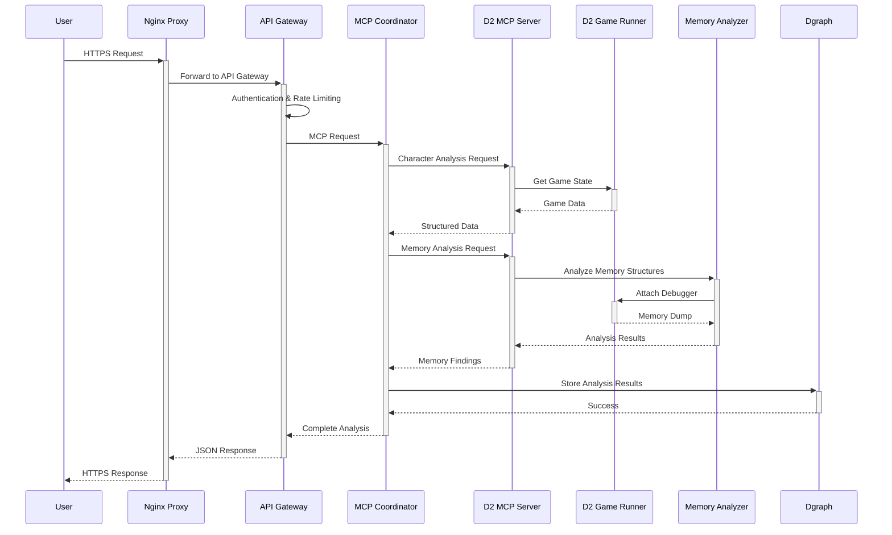
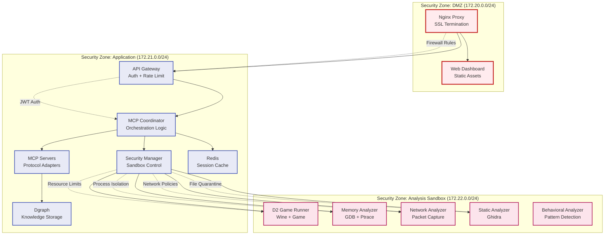

# Container Interaction Analysis & Security Model

## 🔄 **Container Communication Patterns**

### **1. Request Flow Analysis**



### **2. Data Persistence Strategy**

```yaml
# Volume Mapping Strategy
volumes:
  # Hot Data (frequently accessed)
  redis_data:           # Session cache, temporary analysis state
  analysis_outputs:     # Current analysis results
  
  # Warm Data (regularly accessed)  
  dgraph_data:          # Knowledge graph, historical analysis
  game_binaries:        # D2 game files, extracted binaries
  
  # Cold Data (archival)
  static_analysis_cache: # Cached Ghidra analysis results
  audit_logs:           # Security audit trails
  quarantine_storage:   # Quarantined suspicious files

# Network Isolation
networks:
  frontend:    # User-facing services (nginx, web-dashboard)
  backend:     # Internal services (API, coordination, data)
  analysis:    # Sandboxed analysis (game runners, analyzers)
```

### **3. Security Boundaries & Isolation**



## 🛡️ **Container Security Analysis**

### **Resource Isolation & Limits**

```yaml
# Security-First Container Configuration
deploy:
  resources:
    limits:
      memory: 4G      # Hard memory limit
      cpus: '2.0'     # CPU limit
    reservations:
      memory: 2G      # Guaranteed memory
      cpus: '1.0'     # Guaranteed CPU

# Privilege Restrictions
cap_add:
  - SYS_PTRACE      # Only for memory analyzer
cap_drop:
  - ALL             # Drop all other capabilities
  
security_opt:
  - no-new-privileges:true
  - seccomp:unconfined  # Only for analysis containers
  
read_only: true         # Read-only filesystem
tmpfs:                  # Temporary writable areas
  - /tmp
  - /var/tmp
```

### **Network Segmentation Strategy**

| Network Segment | Purpose | Access Rules |
|------------------|---------|--------------|
| **frontend** (172.20.0.0/24) | User-facing services | - External access allowed<br/>- HTTPS only<br/>- Rate limiting |
| **backend** (172.21.0.0/24) | Internal services | - No external access<br/>- Internal service communication<br/>- Authenticated API calls |
| **analysis** (172.22.0.0/24) | Sandboxed analysis | - No external access<br/>- Limited internal communication<br/>- Monitored by security manager |

### **Data Flow Security Controls**

```yaml
# Nginx Security Headers
add_header X-Frame-Options DENY;
add_header X-Content-Type-Options nosniff;
add_header X-XSS-Protection "1; mode=block";
add_header Strict-Transport-Security "max-age=31536000; includeSubDomains";
add_header Content-Security-Policy "default-src 'self'";

# API Gateway Rate Limiting  
rate_limit:
  requests_per_minute: 100
  burst_size: 20
  
# Authentication Requirements
auth:
  jwt_required: true
  api_key_required: true
  session_timeout: 3600
```

## 🚀 **Deployment Scenarios**

### **Development Environment**

```bash
# Development deployment
docker-compose -f docker-compose.optimized.yml -f docker-compose.dev.yml up -d

# Enables:
# - Hot code reloading
# - Debug ports exposed
# - Relaxed security (for development)
# - Additional dev tools (Jupyter, etc.)
```

### **Production Environment**

```bash
# Production deployment with security hardening
docker-compose -f docker-compose.optimized.yml -f docker-compose.prod.yml up -d

# Includes:
# - SSL certificate management
# - Resource monitoring
# - Log aggregation
# - Backup automation
# - Security scanning
```

### **High Availability Setup**

```yaml
# Production HA configuration
deploy:
  replicas: 3
  update_config:
    parallelism: 1
    delay: 10s
    failure_action: rollback
  restart_policy:
    condition: on-failure
    delay: 5s
    max_attempts: 3

# Load balancer configuration
nginx:
  upstream:
    - api-gateway-1:8000
    - api-gateway-2:8000  
    - api-gateway-3:8000
  health_check:
    interval: 30s
    timeout: 5s
    retries: 3
```

## 📊 **Performance & Scaling Analysis**

### **Resource Requirements by Tier**

| Tier | Memory | CPU | Disk | Network |
|------|--------|-----|------|---------|
| **Frontend** | 512M | 1.0 | 1GB | High |
| **API/Orchestration** | 2GB | 2.0 | 10GB | Medium |
| **MCP Servers** | 2GB | 2.0 | 5GB | Medium |
| **Analysis Engines** | 8GB | 4.0 | 50GB | Low |
| **Data Storage** | 4GB | 2.0 | 100GB | Medium |

### **Horizontal Scaling Strategy**

```yaml
# Scalable services (stateless)
scalable_services:
  - api-gateway        # Load balance multiple instances
  - mcp-servers       # Distribute analysis load
  - web-dashboard     # CDN + multiple replicas

# Single instance services (stateful)
singleton_services:
  - dgraph-alpha      # Single writer (can add read replicas)
  - redis            # Single instance with persistence
  - d2-game-runner   # Game instance (unique per analysis session)
```

### **Performance Optimization**

```yaml
# Caching Strategy
redis_cache:
  analysis_results: 1h      # Cached analysis results
  session_data: 24h         # User sessions
  static_analysis: 7d       # Ghidra analysis cache

# Connection Pooling
database_pools:
  dgraph_pool_size: 10
  redis_pool_size: 20
  
# Async Processing
task_queues:
  high_priority: memory_analysis, security_scans
  medium_priority: static_analysis, behavioral_analysis  
  low_priority: report_generation, data_archival
```

## 🔧 **Container Troubleshooting Guide**

### **Common Issues & Solutions**

| Issue | Container | Solution |
|-------|-----------|----------|
| Wine fails to start | d2-game-runner | Check DISPLAY, WINEPREFIX, volumes |
| Memory analysis fails | memory-analyzer | Verify SYS_PTRACE capability |
| Network capture empty | network-analyzer | Check NET_RAW capability, interface |
| Ghidra out of memory | static-analyzer | Increase memory limits |
| API requests timeout | api-gateway | Check backend service health |

### **Health Check Implementation**

```yaml
# Container health checks
healthcheck:
  test: ["CMD", "curl", "-f", "http://localhost:8000/health"]
  interval: 30s
  timeout: 10s
  retries: 3
  start_period: 60s
```

### **Logging & Monitoring**

```yaml
# Centralized logging
logging:
  driver: "fluentd"
  options:
    fluentd-address: "localhost:24224"
    tag: "pd2.{{.Name}}"

# Metrics collection
prometheus_config:
  - job_name: 'containers'
    static_configs:
      - targets: ['api-gateway:9001', 'mcp-coordinator:9001']
```

This optimized architecture provides:

✅ **Proper Separation of Concerns** - Each container has a single, well-defined responsibility
✅ **Security by Design** - Multi-tier network isolation with sandboxed analysis
✅ **Scalability** - Stateless services can be horizontally scaled
✅ **Maintainability** - Clear boundaries and standardized interfaces
✅ **Production Ready** - Comprehensive monitoring, logging, and health checks

The key insight is that **Dgraph is properly containerized** ✅ and **analysis tools are separated** ✅ into specialized containers rather than a monolithic approach.
