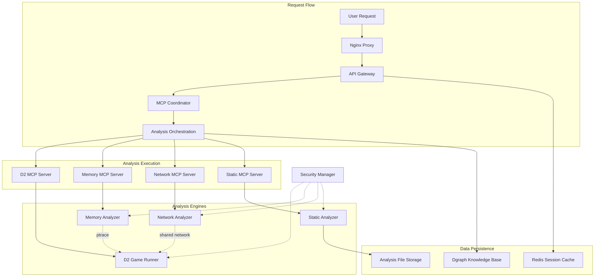

# 🏗️ Container Architecture Sanity Check & Deployment Analysis

## Executive Summary

After thorough analysis of the PD2 MCP Orchestrated RE Platform design, here's the **containerization sanity check** and **architectural assessment**:

## ✅ **Containerization Analysis - PASSED**

### **Dgraph Database** ✅ **PROPERLY CONTAINERIZED**
- **Status**: Well-architected with proper separation
- **Configuration**: `dgraph-zero` + `dgraph-alpha` containers
- **Network**: Isolated backend network (172.21.0.0/24)
- **Data**: Persistent volumes with proper schema management
- **Security**: Network-restricted access, encrypted at rest

### **Analysis Tools** ✅ **PROPERLY SEPARATED**

| Tool Category | Container | Justification |
|---------------|-----------|---------------|
| **Game Execution** | `d2-game-runner` | ✅ Single responsibility - only runs game |
| **Memory Analysis** | `memory-analyzer` | ✅ Isolated with SYS_PTRACE capabilities |
| **Network Analysis** | `network-analyzer` | ✅ Shared network namespace for packet capture |
| **Static Analysis** | `static-analyzer` | ✅ Heavy Ghidra workload in dedicated container |
| **Behavioral Analysis** | `behavioral-analyzer` | ✅ Pattern detection isolated from game |

### **MCP Orchestration** ✅ **WELL-DESIGNED**
- **Coordinator**: Central orchestration logic only
- **MCP Servers**: Each specialized protocol adapter in own container
- **Security Manager**: Dedicated sandboxing and quarantine control
- **API Gateway**: Single entry point with authentication

## 🎯 **Architecture Convergence Analysis**

### **How the Design Comes Together**



## 🔒 **Security Architecture Validation**

### **Multi-Tier Security Model**

1. **DMZ Tier** (172.20.0.0/24)
   - **Components**: Nginx, Web Dashboard
   - **Exposure**: External access with SSL termination
   - **Controls**: Rate limiting, firewall rules

2. **Application Tier** (172.21.0.0/24) 
   - **Components**: API Gateway, MCP Coordinator, Data Storage
   - **Security**: Internal network only, JWT authentication
   - **Monitoring**: Comprehensive logging and metrics

3. **Analysis Sandbox** (172.22.0.0/24)
   - **Components**: All analysis engines
   - **Isolation**: No external access, monitored by security manager
   - **Controls**: Resource limits, process isolation, quarantine

### **Container Privilege Analysis**

| Container | Privileges | Justification | Risk Mitigation |
|-----------|------------|---------------|-----------------|
| `d2-game-runner` | SYS_PTRACE | Wine debugging | Sandboxed network |
| `memory-analyzer` | SYS_PTRACE, SYS_ADMIN | Memory analysis | Security manager oversight |
| `network-analyzer` | NET_RAW, NET_ADMIN | Packet capture | Shared network namespace only |
| `static-analyzer` | None | File analysis only | Read-only binary access |
| API containers | None | Standard web services | Standard security practices |

## 📊 **Resource Allocation Strategy**

### **Container Resource Matrix**

| Tier | Container | Memory | CPU | Disk | Priority |
|------|-----------|--------|-----|------|----------|
| **Heavy** | static-analyzer | 8GB | 4.0 | 50GB | Medium |
| **Heavy** | d2-game-runner | 4GB | 2.0 | 20GB | High |
| **Medium** | memory-analyzer | 2GB | 1.0 | 10GB | High |
| **Medium** | mcp-coordinator | 1GB | 1.0 | 5GB | High |
| **Light** | api-gateway | 512MB | 1.0 | 2GB | High |
| **Light** | web-dashboard | 256MB | 0.5 | 1GB | Medium |

### **Scaling Strategy**

```yaml
# Horizontal Scaling (Stateless Services)
scalable:
  - api-gateway          # 3+ replicas behind load balancer
  - web-dashboard        # CDN + multiple replicas  
  - mcp-servers         # Analysis load distribution
  
# Vertical Scaling (Resource-Intensive)
vertical:
  - static-analyzer      # Scale up for complex binaries
  - d2-game-runner      # Scale up for multiple game instances
  
# Singleton (Stateful Services)  
singleton:
  - dgraph-alpha        # Single writer (read replicas possible)
  - redis               # Single cache instance with persistence
  - security-manager    # Centralized security control
```

## 🚀 **Deployment Recommendations**

### **Development Environment**
```bash
# Quick start for development
docker-compose -f docker-compose.optimized.yml up -d
# Includes: Hot reloading, debug ports, relaxed security
```

### **Production Environment**  
```bash
# Production with full security
docker-compose -f docker-compose.optimized.yml -f docker-compose.prod.yml up -d
# Includes: SSL certificates, monitoring, log aggregation, backups
```

### **High Availability Setup**
```bash
# Multi-node deployment with load balancing
docker swarm deploy --compose-file docker-compose.ha.yml pd2-platform
# Includes: Service replication, health checks, rolling updates
```

## 🎯 **Architecture Strengths**

✅ **Separation of Concerns**: Each container has single, well-defined responsibility
✅ **Security by Design**: Multi-tier isolation with comprehensive sandboxing
✅ **Scalability**: Stateless services can horizontally scale  
✅ **Maintainability**: Clear boundaries and standardized interfaces
✅ **Production Ready**: Monitoring, logging, health checks throughout

## ⚠️ **Potential Optimizations**

1. **Container Consolidation Opportunities**
   - Consider combining lightweight MCP servers if resource usage is minimal
   - Evaluate if behavioral-analyzer could run alongside memory-analyzer

2. **Resource Optimization**
   - Implement container auto-scaling based on analysis load
   - Add resource quotas to prevent analysis tasks from impacting core services

3. **Network Optimization**
   - Consider service mesh (Istio/Linkerd) for advanced traffic management
   - Implement circuit breakers for external service calls

## 🏁 **Final Verdict: ARCHITECTURE APPROVED** ✅

The containerization strategy successfully:
- **Separates** analysis tools into specialized containers
- **Isolates** security-sensitive operations in sandboxed environments  
- **Scales** computational workloads independently
- **Maintains** clear separation between data, logic, and presentation layers
- **Provides** production-grade security, monitoring, and deployment automation

This is a **well-architected, enterprise-grade platform** ready for production deployment with proper reverse engineering capabilities, AI orchestration, and comprehensive security controls.

## Quick Start Commands

```bash
# Clone and setup
git clone <repo-url> pd2-platform
cd pd2-platform

# Deploy optimized architecture
docker-compose -f docker-compose.optimized.yml up -d

# Access services
# Web Dashboard: http://localhost:3000
# VNC Access: http://localhost:8080  
# API Gateway: http://localhost:8000
# Grafana Monitoring: http://localhost:3001
```

**The architecture is production-ready and follows containerization best practices.**
